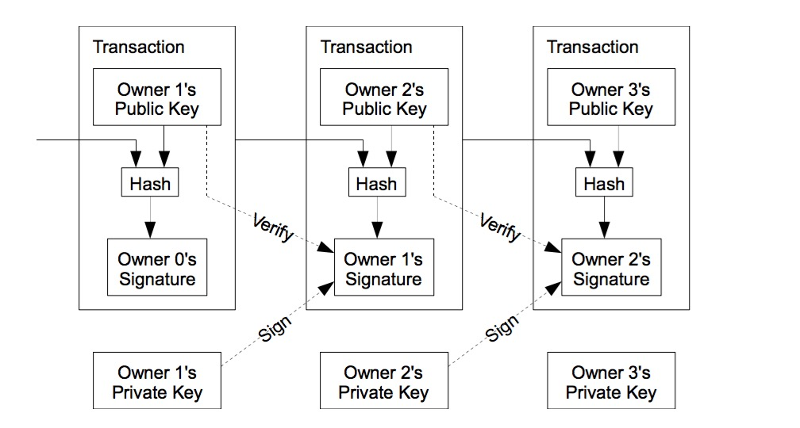
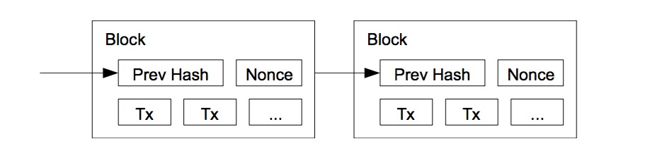
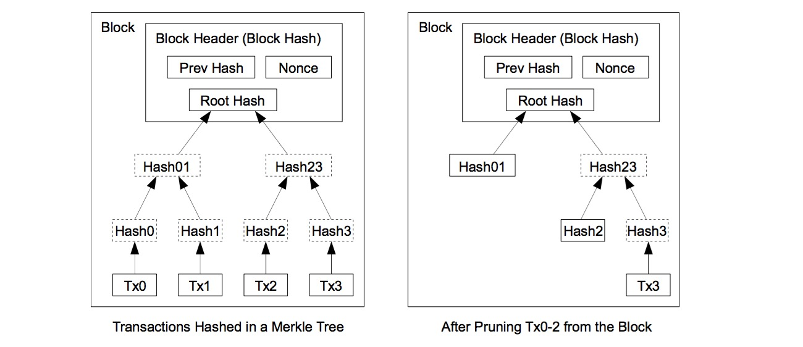

###0.摘要
	
纯粹的点对点的对等网络版的电子现金，将允许在线支付从一方到另一方，中间而无需通过金融机构去撮合交易。数字签名解决了一部分问题，但如果仍需要信任的第三方来防止防止重复支付，那么数字签名的好处的将消失。我们提出使用点对点的对等网络来解决重复支付问题。网络通过散列支付交易，让支付交易形成一个不断增长的，基于散列的工作量证明链，从而达到为这些交易打上时间戳的目的。打上的时间戳的交易就形成了一条记录，这条记录不需要重新计算工作量证明来防止修改。最长的链条不仅是证明了的交易发生的顺序，而且证明来自CPU处理能力最强的地方。只要大多数CPU处理能力，不是来自于被操纵用作攻击的节点，那么这些节点的CPU就能生产出最长的交易链，从而超过那些被用做攻击的网络节点。网络本身必须满足最少的结构，交易的消息应尽最大努力的广播到网络中的节点上，并且网络中的节点可以随意离开或者加入网络。这些节点接受最长工作量证明链作为交易的证明，即使相关参与交易的节点已经不在网络中了。

###1.背景介绍
网上电子商务几乎已经完全依赖于金融机构作为受信任的第三方来处理电子支付。尽管这一方式做形成的系统，对大部分交易处理的不错，但是仍然由于其先天的授信模型的缺陷而导致部分交易出问题。

完全不可逆的交易是不是真的有可能，因为金融机构无法避免调解纠纷。调解的成本增加了交易成本，从而限制了最小实际交易规模和切断的小额交易的可能系。而这些会因为提供不可逆交易提供服务，从而提高了成本。为了达到可逆交易，信任信息需要扩展到更多的方面。所以商业机构必须骚扰他们的顾客，以得到跟多的信息，而这些信息比他们需要的还要多的多。一定比例的金融诈骗被认为是不可避免的事情。这些支付的不确定性其实可以通过面对面的实物货币交易来避免。但是却没有一种机制，可以让交易在没有金融机构参与下，通过双方通信的就能完成。

电子支付需要做的只是通过密码学的方式来代替信托的方式。这一方式可以让双方直接交易，从而不需要引入受信任的第三方。交易在计算层面地不可逆保证了卖家的利益，而日常的托管机制则在另一方面保证了买家的利益。在本论文中，我们将详细讨论一种避免重复交易的解决方案，这个方案被用于点对点对等网络中的分布式的时间戳服务器，而这些服务器将按照交易的先后次序去生成可计算的证据。整个系统，只有在好的节点控制着比坏的节点多的CPU处理能力的情况下，才是安全的。

###2.交易

我们将一条数字签名链条当做一个电子币。当这个电子币的拥有者要把电子货币转账给收款人时，拥有者首先将散列之前的交易链和收款人的公钥并签名，然后将这些加到这个电货币的后面。而收款人通过对一系列签名的校验，来确认拥有者的记录。当然，这种情况下，收款人依然不能确定付款人是否重复消费了这个电子币。最普通的解决方案就是引入一个可信赖的第三方权威机构或者铸币机构，对每一笔交易进行重复消费检查。每一笔交易之后，交易的电子币必须归档到铸币机构，然后铸币机构再发行一个新的电子币。只有铸币机构直接发行的电子币才能保证不会被重复消费。这个解决方案的问题在于整个系统命运是建立在一个运行这个铸币机构的公司之上的。每一笔交易必须通过他们，就像今天的银行一样。

我们需要知道对于这个电子货币，持有者是否在与我们交易之前就消费过这枚电子货币。基于这样一种原因，假设早前的交易已经被已计入了，那么我们就不用关心是否重复支付。要做到这点，唯一的方法是了解所有的交易，以保证没有一笔交易会被遗漏。在铸币机构这样一个模型下，铸币机构知道所有交易，并且由他们来决定交易的先后次序。而如果要达到模型中不存在铸币机构，就需要向所有公众公示，并且需要一个系统来让所有的参与方都可以对他们所收到的历史交易的次序做一个统一的认定。而收款人需要每一笔交易即时的证据来证明。

###3.时间戳服务器

这个问题的解决方案起始于一个时间戳服务器。时间戳服务器的工作是将一连串项目组成的区块散（hash）成一个哈希值（hash value），然后尽可能的广泛的发布这个哈希值，就跟报纸和新闻组一样。时间戳证明了这块数据的当时确实存在，而且很明显是按照时间戳的顺序存在。每一个时间戳都在他的散列的哈希值中包含之前的时间戳，而每一个被加上的时间戳都需要他之前的时间戳作为输入参数，由此我们得到了一个时间戳的链。

###4.工作量证明

为了实现分布式的时间戳服务系统，我们需要引入一种叫亚当 巴克的Hashcrash系统，而是不是新闻组或者报纸这种系统。工作量证明系统是由一种扫描工作组成，这个扫描工作是取得在散列的一个值。类似于SHA256，散列过程起始于一系列为零位数的值。所需的平均工作时间所需的位数零位数的指数，并可以通过执行单一的散列验证。对于时间戳网络来讲，我们需要通过在区块中递增一个随机数，直到找到一个值，这个是散列这个块所需的零比特的位数。一旦CPU的计算力达成了这工作量证明的工作。这个区块的散列工作讲会被保留下来而不需要重做这个工作，而排在后面的区块则是建立在这一区块哈希值的基础之上的。一旦改变了这一区块，那么后面的区块也需要重新计算。

工作量证明的还解决了在少数服从多数的决策系统中代表选取问题。如果基于多数的计算方法基于一个IP一个选票的话，他可以轻松被那些能够分配多个IP的人所颠覆。而工作量证明实际上是一个CPU一个选票。最长的链便代表的多数派的决策，而这条链也代表了最多了工作量。如果多数派的CPU是被诚信的节点所控制的，那么诚信链条增长将是最快的，快到超过任何其他的竞争链条。而要修改一个过去的区块，攻击者面临需要改变这个区块的工作量证明以及所有之后的区块的工作量证明，并且赶上并超过诚信节点的工作能力。后面我们将展示一个计算能力比较慢的攻击者因为区块的增加，攻击成功的概率如何以指数速率降低的。

为了弥补因为硬件速度升级以及在运行节点中的随时间变化的变化的利息，工作量证明系统的设计难度就变成了，在一个系统中每个小时平均命中多少次区块。如果生成的太快了，那么这个难度就增加了。

###5.网络
######运行一个网络的步骤如下：
		
1.	 新的交易记录会广播到所有节点。
2.	 每个节点将把新的交易记录收集到一个区块里。
3.	 每个节点都会为他的区块寻找一个困难的工作量证明。
4.	 当一个节点发现一个工作量证明，它会向所有节点广播这个区块。
5.	 节点群接受在区块时，会检查该区块所有交易都是否有效且没有被消费。
6.	 节点群表示他们通过在创建下一个块在工作链在表示他们接受这个区块的。具体方式是对接受块作为散列来创建新的块。

节点群将始终将最长的链作为正确的链，并且将在这个链上进行扩充，叠加新的节点。如果两个节点同时对于同一个区块的两个不同的版本，其中一些网络节点可能接受了先接受了其中一个版本，另一些网路节点可能接受了另一个版本。在这种情况下，他们会基于第一个收到的区块进行扩充和叠加，但是同时会保留另外一个，以防另外一个会变成更长的区块链。这个平局将在下一个工作量证明被发现的时候被打破，因为其中一个链将会变的更长。而那些不在这个最长的链上扩充和叠加信息的节点也会迁移过来。

新的交易并不需要达到所有节点，只要他们能够在区块链变的更长之前达到足够多的节点。区块的广播对于广播信息丢失也是兼容的，如果一个节点没有收到一个区块的广播，那么这个节点在收到这个区块的下一个区块的广播时，会意识到他丢失了一个区块，那么他会向别的节点请求这个丢失的区块信息。

###6. 激励网络的驱动力（Incentive）
按照惯例，一个区块中的第一笔交易是一笔特殊的交易，这个交易是由一个新发币开始的，这个新发币的拥有者是这个区块的创建者。这个加入了新币的活动是对整个网络的激励和支持。他提供了一种初始货币发行的到流通环节的方法。因为在这个系统中没有中央的权威机构来发行货币。一个稳定常数的发行新币的数量，类似于黄金旷工花费资源挖金矿，并且将挖到的黄金投入到流通市场上去。在我们的案例中，消耗的资源便是CPU的时间和电力。

此外，激励的措施还包括对于交易提取的费用。如果一个交易的输出的价格小于这个交易最初输入的价格，那么这两个价格之间的差值便是交易的费用。这个费用会被加到区块的激励值，从而包含在交易当中。一旦预定数量的货币进入流通环节之后，激励可以完全由交易费用产生，并且完全可以避免通货膨胀。

这种激励也许可以让节点群保持诚信。如果一个贪婪的攻击者可以获得CPU处理能力比诚信的节点群多。那么他会面临两种选择，一种是通过伪造的交易记录的手段来获利；另一种是用这些CPU的处理能力来制造更多的货币。他应该可以发现遵守游戏股则，可以让他获取比别人跟多的利益，这比起破坏系统达从而达到的自身财富增长要好的多。

###7.	回收磁盘空间
一旦最近的一个关于一个货币的交易被埋在了足够多的区块之前，那在这个区块之前的花费这个货币的交易区块就可以被丢弃掉了。要达成这个目标，并不需要破坏区块的哈希值，这些交易可以被散列到一个Merkle Tree的结构中，只要根节点包含这个区块的哈希值就可以了。老的区块可以通过截断分支的方法来压缩。内部的哈希值就不需要存储了。

一个没有交易的区块头大约80个字节。如果我们假设10分钟产生一个区块，那么80字节x 6 x24 x365=4.2MB每年。对应于2008年搭载主流配置的2GB内存的电脑的售卖和摩尔定律的预测每年平均1.2GB的增长，存储将应该不是问题，即使我们需要将每个区块的区块头保存在内存中。

###8.简化的支付验证

不需要运行一个完成的网络节点来验证支付是可行的。一个用户只需要保持最长工作量证明的区块的头即可。

TODO

###9.组合和分离值
TODO

###10.隐私

TODO

###11.计算
TODO

###12.推论
TODO

